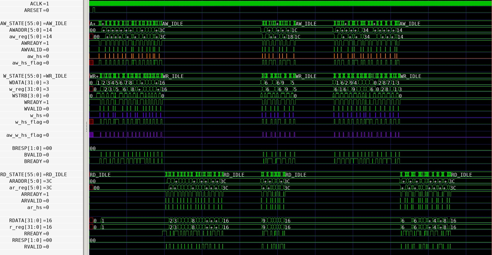

# AMBA-AXI-Lite
Implemented AXI-Lite interface slave and AXI-Lite interface BFM(Bus Functional Model) master.

## Overview

## Write Transaction

## Read Transaction

## Full Waveform

## Usage
* `$ make` : Compile and Run 
* `$ make sim` : Run simulation 